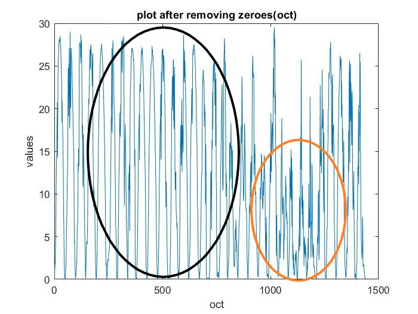

# Forecast of solar generation 
The irradiation and generation data provided in excel sheets contains lot of noise and NAN values and the data isn't aligned as well ie there are irregularities in the data.
The data is measured at every 15 minute interval for one year of solar irradiation and solar generation on the solar panels in NITK Surathkal.

# Preprocessing the data

The first step is to preprocess the data. The irradiation and generation data are measured in different units and hence for better training , testing and prediction the noise in the data has to removed and the data should be normalized. The zero valeus have to be removed. Used only 2500 data points from the excel file.

The generation data is used as training data(input) and irradiation data is used testing data(target) . 
After removing the noise , NAN values , zero values and normalizing the data we the below plot . 

 

Taking plot of 1000 points for better clarity

 

# Clear and Cloudy Days
// whole year plot 
We can differentiate between the clear days and the cloudy days by analysing the data plots.

 

For instance the this plot above is of the // month . We can clearly see that on the days marked in Orange the solar generation is lower compared to the other days (marked in Black). We conclude the days with lower generation as Cloudy days and remaining days as Clear days .

