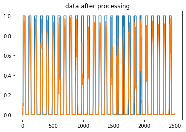
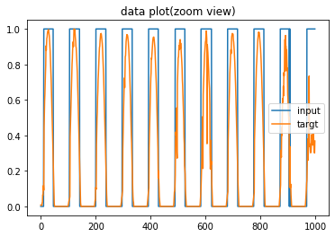
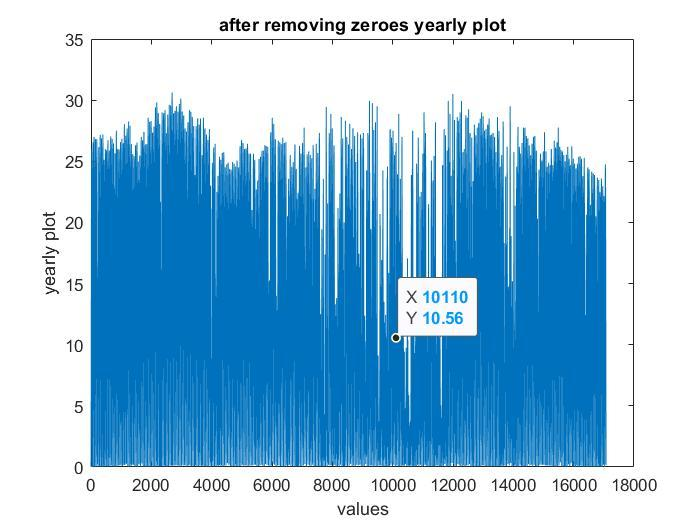
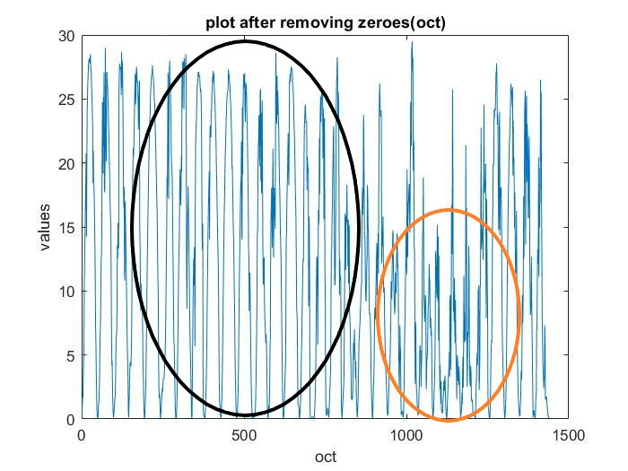
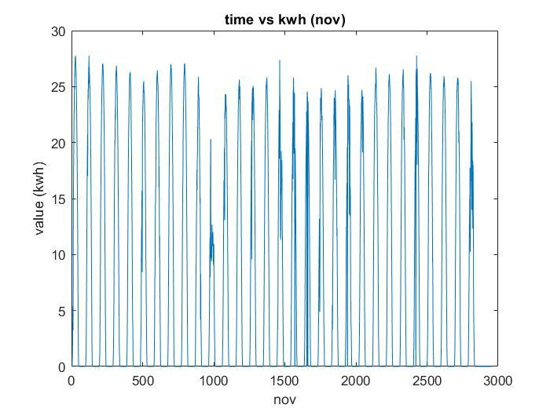
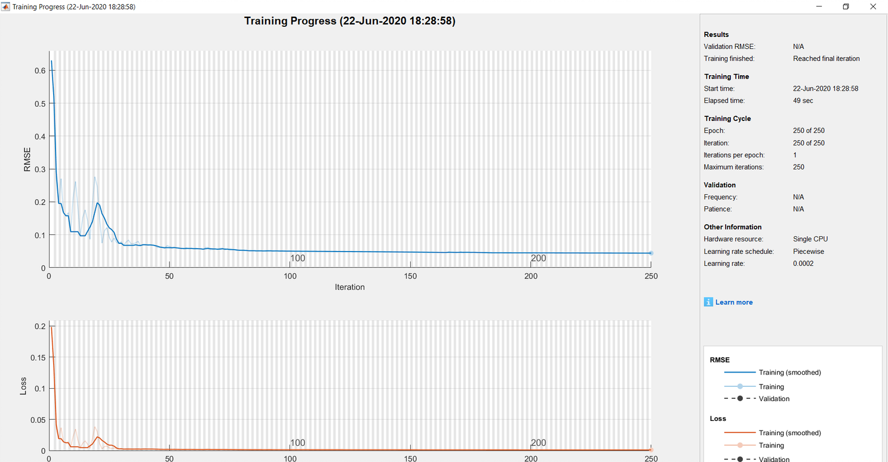
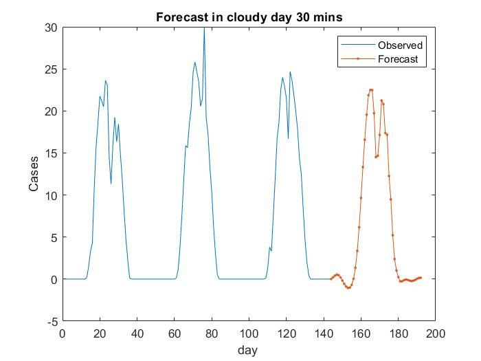
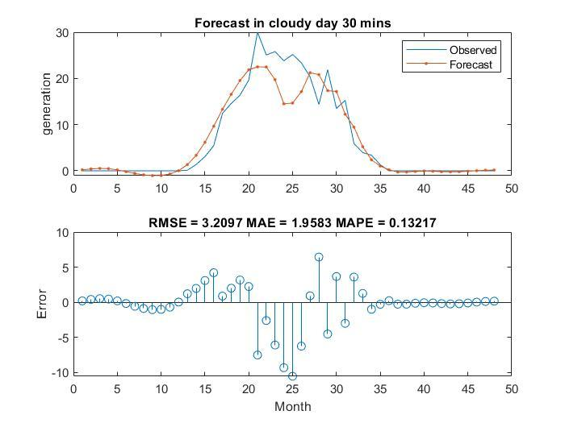
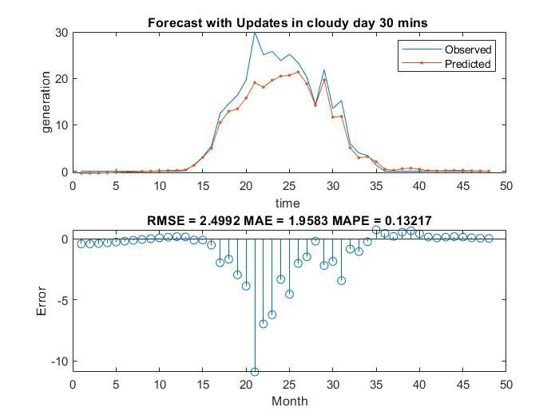

# Forecast of solar generation 
The irradiation and generation data provided in excel sheets contains lot of noise and NAN values and the data isn't aligned as well ie there are irregularities in the data.
The data is measured at every 15 minute interval for one year of solar irradiation and solar generation on the solar panels in NITK Surathkal.

# Preprocessing the data

The first step is to preprocess the data. The irradiation and generation data are measured in different units and hence for better training , testing and prediction the noise in the data has to removed and the data should be normalized. The zero valeus have to be removed.

The generation data is used as training data(input) and irradiation data is used testing data(target) . 
After removing the noise , NAN values , zero values and normalizing the data we the below plot . 

 

Taking plot of 1000 points for better clarity

 

# Clear and Cloudy Days

 
We can differentiate between the clear days and the cloudy days by analysing the data plots.

 

For instance the this plot above is of October. We can clearly see that on the days marked in Orange the solar generation is lower compared to the other days (marked in Black). We conclude the days with lower generation as Cloudy days and remaining days as Clear days .
The Y-axis represents units generated(KWh) and X-axis represents Time data points one unit is 15 mins.

# Testing , Training 
After carefully analysing the data set we need to divide them into clear day data and cloudy day data. 
Cloudy generation data and its corresponding irradiaton data set are sliced and joined.  
To forecast for every 15,30,45 and 60 mins we need the data for every 15,30,45 and 60 min interval.  
Alternate points are taken from the given 15 min data points to create the 30 mins data set.  
Similary every third and fourth data is taken from the 15 min data set to get 45 and 60 min data set. 

# RNN
An artifical recurrent neural network based on LSTM(long short-term memory) ANN is used .  
We train a sequence-to-squence regression LSTM network where the responses are training sequences with values 
shifted by one time step. It means at every time step of the input sequence the LSTM network learns to predict the value of the next time step. 
The LSTM network predicts the forecast and then the network state is updated using the observed values. 

 
 

We used the predictAndUpdateState function to forecast the multiple time steps in the future and update the network step at each prediction. 

  
The generation data set for each forecast is divided into two parts for training and testing  in the ratio 3:1,
ie 75% training and 25% testing.

 

# Forecast 
We have a total of 8 forcasts 15,30,45 and 60 mins for 2 days of clear and cloudy day. 
We are going to consider Forecast of Cloudy day at every 45 min interaval here.
The LSTM model is trained of 75% of the data and uses root-mean-square error(RMSE) for the training progress

 

 
  

# Update 
If the network state is update using the acutal values ,the forecast is more accurate . 
The network state is initialized and reset . Resetting the network state prevents the previous prediction from affecting the predictions on new data. The network state is intialized on the new training data. 
The resultant forecast is more accurate .
 

 

#  Code 
The code forecasts  and produces plots  for all the datasets.

