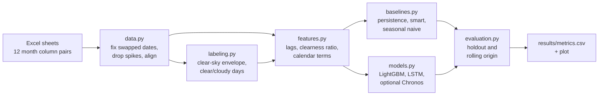

<div align="center">

# solarcast

**Honest short-term solar generation forecasting for NITK Surathkal, with baselines that actually have to be beaten.**

[](https://github.com/amanyagami/Forecast-of-solar-generation/actions/workflows/ci.yml)
[](LICENSE)
[](pyproject.toml)
[](https://docs.astral.sh/uv/)


<sub>Holdout RMSE (kWh per 15 min, daylight steps) vs horizon. Lower is better.</sub>

</div>

One year of 15-minute generation and irradiation data, forecast 15 / 30 / 45 / 60 minutes ahead.
The original MATLAB LSTM project (kept in [`matlab/code.m`](matlab/code.m), write-up at the bottom)
had no baseline; this repo adds persistence, smart persistence and seasonal-naive references,
leak-free chronological and rolling-origin evaluation, LightGBM, and a small LSTM.

## Headline results

Holdout test period 2019-09-19 to 2019-12-01. RMSE in kWh per 15 min; skill vs persistence in
brackets (positive = better than persistence).

| Model | clear 15 min | clear 60 min | cloudy 15 min | cloudy 60 min |
|---|---|---|---|---|
| Persistence | 2.271 | 5.644 | 3.085 | 5.996 |
| Smart persistence | 1.968 (+0.13) | 2.920 (+0.48) | 2.999 (+0.03) | 4.943 (+0.18) |
| Seasonal naive | 4.485 (-0.98) | 4.491 (+0.20) | 6.919 (-1.24) | 6.922 (-0.15) |
| LightGBM | 1.914 (+0.16) | 2.879 (+0.49) | 2.826 (+0.08) | 4.757 (+0.21) |
| LSTM | 1.946 (+0.14) | 2.721 (+0.52) | 2.889 (+0.06) | 4.775 (+0.20) |

| Takeaway | Evidence |
|---|---|
| Learned models beat persistence only modestly at 15 min | skill +0.06 to +0.16 |
| The gain grows with horizon | skill +0.20 to +0.52 at 60 min |
| Smart persistence gets most of the clear-day gain | within a few percent of the learned models at 30-60 min on clear days |
| LightGBM vs LSTM is close to a tie | LightGBM ahead on cloudy days, LSTM on clear days from 30 min; one seed, no significance test |
| Cloudy days stay hard | skill never exceeds +0.21 for any model |

<details>
<summary>Full tables (holdout and rolling origin, all horizons and regimes)</summary>

**Holdout, clear days** (n = 1927 daylight steps per horizon)

| Model | clear 15 min | clear 30 min | clear 45 min | clear 60 min |
|---|---|---|---|---|
| Persistence | 2.271 | 3.446 | 4.534 | 5.644 |
| Smart persistence | 1.968 (+0.13) | 2.443 (+0.29) | 2.672 (+0.41) | 2.920 (+0.48) |
| Seasonal naive | 4.485 (-0.98) | 4.487 (-0.30) | 4.488 (+0.01) | 4.491 (+0.20) |
| LightGBM | 1.914 (+0.16) | 2.453 (+0.29) | 2.837 (+0.37) | 2.879 (+0.49) |
| LSTM | 1.946 (+0.14) | 2.254 (+0.35) | 2.457 (+0.46) | 2.721 (+0.52) |

**Holdout, cloudy days** (n = 1168 daylight steps per horizon)

| Model | cloudy 15 min | cloudy 30 min | cloudy 45 min | cloudy 60 min |
|---|---|---|---|---|
| Persistence | 3.085 | 4.247 | 5.186 | 5.996 |
| Smart persistence | 2.999 (+0.03) | 3.911 (+0.08) | 4.519 (+0.13) | 4.943 (+0.18) |
| Seasonal naive | 6.919 (-1.24) | 6.924 (-0.63) | 6.932 (-0.34) | 6.922 (-0.15) |
| LightGBM | 2.826 (+0.08) | 3.677 (+0.13) | 4.241 (+0.18) | 4.757 (+0.21) |
| LSTM | 2.889 (+0.06) | 3.815 (+0.10) | 4.393 (+0.15) | 4.775 (+0.20) |

**Holdout, all days** (n = 3131 daylight steps per horizon)

| Model | all 15 min | all 30 min | all 45 min | all 60 min |
|---|---|---|---|---|
| Persistence | 2.611 | 3.773 | 4.800 | 5.791 |
| Smart persistence | 2.414 (+0.08) | 3.089 (+0.18) | 3.500 (+0.27) | 3.832 (+0.34) |
| Seasonal naive | 5.525 (-1.12) | 5.525 (-0.46) | 5.532 (-0.15) | 5.532 (+0.04) |
| LightGBM | 2.307 (+0.12) | 2.981 (+0.21) | 3.443 (+0.28) | 3.709 (+0.36) |
| LSTM | 2.350 (+0.10) | 2.950 (+0.22) | 3.334 (+0.31) | 3.650 (+0.37) |

**Rolling, clear days** (n = 2016 daylight steps per horizon)

| Model | clear 15 min | clear 30 min | clear 45 min | clear 60 min |
|---|---|---|---|---|
| Persistence | 2.314 | 3.482 | 4.574 | 5.669 |
| Smart persistence | 2.054 (+0.11) | 2.534 (+0.27) | 2.791 (+0.39) | 3.034 (+0.46) |
| Seasonal naive | 4.809 (-1.08) | 4.812 (-0.38) | 4.813 (-0.05) | 4.816 (+0.15) |
| LightGBM | 1.982 (+0.14) | 2.485 (+0.29) | 2.788 (+0.39) | 2.920 (+0.48) |
| LSTM | 1.901 (+0.18) | 2.235 (+0.36) | 2.510 (+0.45) | 2.707 (+0.52) |

**Rolling, cloudy days** (n = 2965 daylight steps per horizon)

| Model | cloudy 15 min | cloudy 30 min | cloudy 45 min | cloudy 60 min |
|---|---|---|---|---|
| Persistence | 3.229 | 4.540 | 5.328 | 5.959 |
| Smart persistence | 3.273 (-0.01) | 4.419 (+0.03) | 4.963 (+0.07) | 5.298 (+0.11) |
| Seasonal naive | 6.929 (-1.15) | 6.934 (-0.53) | 6.931 (-0.30) | 6.924 (-0.16) |
| LightGBM | 3.019 (+0.07) | 4.046 (+0.11) | 4.521 (+0.15) | 4.915 (+0.18) |
| LSTM | 3.032 (+0.06) | 4.083 (+0.10) | 4.603 (+0.14) | 4.988 (+0.16) |

**Rolling, all days** (n = 5017 daylight steps per horizon)

| Model | all 15 min | all 30 min | all 45 min | all 60 min |
|---|---|---|---|---|
| Persistence | 2.894 | 4.145 | 5.040 | 5.850 |
| Smart persistence | 2.843 (+0.02) | 3.772 (+0.09) | 4.224 (+0.16) | 4.527 (+0.23) |
| Seasonal naive | 6.152 (-1.13) | 6.155 (-0.48) | 6.155 (-0.22) | 6.152 (-0.05) |
| LightGBM | 2.650 (+0.08) | 3.500 (+0.16) | 3.914 (+0.22) | 4.224 (+0.28) |
| LSTM | 2.633 (+0.09) | 3.457 (+0.17) | 3.896 (+0.23) | 4.220 (+0.28) |

Seasonal naive is evaluated but not a contender. MAE and nRMSE are in `results/metrics.csv`.

</details>

## Pipeline


```mermaid
flowchart LR
    A["Excel sheets<br/>12 month column pairs"] --> B["data.py<br/>fix swapped dates,<br/>drop spikes, align"]
    B --> C["labeling.py<br/>clear-sky envelope,<br/>clear/cloudy days"]
    B --> D["features.py<br/>lags, clearness ratio,<br/>calendar terms"]
    C --> D
    D --> E["baselines.py<br/>persistence, smart,<br/>seasonal naive"]
    D --> F["models.py<br/>LightGBM, LSTM,<br/>optional Chronos"]
    E --> G["evaluation.py<br/>holdout and<br/>rolling origin"]
    F --> G
    G --> H["results/metrics.csv<br/>+ plot"]
```

## Quick start

```bash
uv sync                                   # core: numpy, pandas, openpyxl, scikit-learn, lightgbm, matplotlib
uv run solarcast evaluate                 # baselines + LightGBM (LSTM skipped without torch)
uv run --extra deep solarcast evaluate    # adds the LSTM (installs torch)
uv run --extra deep --extra foundation solarcast evaluate --models lightgbm lstm chronos
uv run pytest && uv run ruff check src tests && uv run ruff format --check src tests
```

| Option | Meaning |
|---|---|
| `--protocol holdout\|rolling\|both` | Evaluation protocol (default both) |
| `--models lightgbm lstm chronos` | Learned models to include; baselines always run |
| `--data-dir`, `--out-dir` | Input folder with the two `.xlsx` files, output folder |

The full run (baselines, LightGBM, LSTM, both protocols) took about 2 minutes wall time on a
4-core CPU; LSTM training accounts for most of it. Chronos needs Hugging Face weights; if they
cannot be downloaded it is skipped with a warning (they could not be downloaded when the numbers
above were produced, so **Chronos was not evaluated**).

## Method

| Item | Choice |
|---|---|
| Task | At origin `t`, using data up to `t` only, forecast generation at `t + h`, h = 15/30/45/60 min. No weather forecast, no future irradiation. |
| Clear/cloudy | Per time-of-day 95th-percentile envelope over 31 days (pvlib not used: a physical model needs PV system capacity/tilt/losses to match metered kWh). Daily clearness index >= 0.8 is clear, otherwise cloudy; under 90% daylight coverage is unknown. Gives 199 clear, 160 cloudy, 7 unknown days. Labels use the day's own outcome, so they stratify the report and are never model inputs. |
| Models | Persistence; smart persistence (persist the clearness ratio times the causal envelope); seasonal naive (same time yesterday); LightGBM (one regressor per horizon on lags, rolling stats, clearness ratio, envelope, calendar terms); LSTM (32 units, 4 h window, all horizons jointly, CPU, fixed seed and fixed physical scaling). |
| Holdout | Chronological 60/20/20 by whole days, scored on the last 20%; fit on targets before the test start; last 15% of fit days used for LightGBM early stopping. |
| Rolling origin | 4 expanding-window folds of 30 days (2019-08-04 to 2019-12-01). A 4-step gap removes training rows whose target overlaps the test block. |
| Scoring | RMSE on daylight steps only, identical rows for every model; skill = 1 - RMSE / RMSE_persistence. Missing targets or forecasts are dropped, never imputed. |

## Data notes

| Finding | Detail |
|---|---|
| Layout | Each sheet has 12 side-by-side `(Date, value)` column pairs, one per month, 2018-12-01 to 2019-12-01 (35,040 slots at 15 min). |
| Swapped dates | Excel parsed days 1-12 of each month as `mm/dd` (1 Nov 2019 is stored as 11 Jan 2019); days 13-31 are `dd/mm/yyyy` text. `solarcast.data` swaps them back; no duplicates remain. |
| Generation spikes | 258 readings (0.75%) are paired `-X, +X` of about 500,000 (a cumulative register leaking in, e.g. 2018-12-01 08:15/08:30). Real values are 0-30.6 kWh per 15 min. The MATLAB `TestIp>50 = 30` hid this. Spikes become NaN. |
| Missing data | Generation lacks 00:00-05:15 on day 1 of each month (night, filled with 0 only where irradiation confirms darkness) and all of 2019-08-28/29. Raw sheets miss 434 generation and 7 irradiation slots. After cleaning, 1.2% of generation and 1.3% of irradiation are NaN. |
| Row offset | Generation starts at 05:30, irradiation at 00:15: a 21-row offset, which is why the MATLAB code slices rows `76:459` against `97:480` by hand. Timestamp matching removes it. |
| Units | Irradiation is labelled Wh/m2 but peaks around 1000-1350, so it behaves like W/m2. |
| Timestamp convention | Correlation with generation is slightly higher with irradiation one step later (0.957 vs 0.955), suggesting an interval-end label. Not corrected. |

### How the MATLAB code differs

The network input is `[irradiation(t); generation(t)]` and the target is `generation(t+1)`. In the
test period it is fed the *measured* irradiation plus its own previous prediction, so it is a
step-ahead nowcast with future irradiation observed, not a forecast from generation alone.
Normalisation uses the min/max of the whole series (test part included), days were chosen by eye
and hard-coded as row ranges (e.g. a 384-row, four-day slice with a 75/25 split), and there was
no baseline.

## Limitations

| Limitation | Consequence |
|---|---|
| One site, one year, one calendar split | Holdout is Sep 19 - Dec 1 (post-monsoon); training saw only the first half of the monsoon. Results may not transfer to other seasons. |
| Single seed, no confidence intervals | Differences of a few percent between LightGBM and LSTM are not established. The LSTM is small and untuned; LightGBM uses fixed hyperparameters. |
| Clear/cloudy uses a data-driven envelope | Biased low in the monsoon, and based on the day's own outcome, so the rows are diagnostic strata, not a forecastable condition. |
| Irradiation is only a lagged input | No numerical weather prediction or sky imagery. |
| Ambiguous irradiation units and one-step stamp offset | Documented, not corrected. |
| Chronos untested | Weights could not be downloaded, so no Chronos numbers exist. |
| Daylight steps only | Night is trivially zero and would flatter every model. |

## License

MIT, see [LICENSE](LICENSE).

---

# Original MATLAB write-up

The irradiation and generation data provided in excel sheets contains lot of noise and NAN values and the data isn't aligned as well ie there are irregularities in the data.
The data is measured at every 15 minute interval for one year of solar irradiation and solar generation on the solar panels in NITK Surathkal.

# Preprocessing the data

The first step is to preprocess the data. The irradiation and generation data are measured in different units and hence for better training , testing and prediction the noise in the data has to removed and the data should be normalized. The zero valeus have to be removed.

The generation data is used as training data(input) and irradiation data is used testing data(target) . 
After removing the noise , NAN values , zero values and normalizing the data we the below plot . 


<br>

Taking plot of 1000 points for better clarity


<br>


# Clear and Cloudy Days


<br>
We can differentiate between the clear days and the cloudy days by analysing the data plots.


<br>

For instance the this plot above is of October. We can clearly see that on the days marked in Orange the solar generation is lower compared to the other days (marked in Black). We conclude the days with lower generation as Cloudy days and remaining days as Clear days .
The Y-axis represents units generated(KWh) and X-axis represents Time data points one unit is 15 mins.

# Testing , Training 
After carefully analysing the data set we need to divide them into clear day data and cloudy day data.<br>
Cloudy generation data and its corresponding irradiaton data set are sliced and joined. <br>
To forecast for every 15,30,45 and 60 mins we need the data for every 15,30,45 and 60 min interval. <br>
Alternate points are taken from the given 15 min data points to create the 30 mins data set. <br>
Similary every third and fourth data is taken from the 15 min data set to get 45 and 60 min data set.<br>


# RNN
An artifical recurrent neural network based on LSTM(long short-term memory) ANN is used . <br>
We train a sequence-to-squence regression LSTM network where the responses are training sequences with values<br>
shifted by one time step. It means at every time step of the input sequence the LSTM network learns to predict the value of the next time step.<br>
The LSTM network predicts the forecast and then the network state is updated using the observed values.<br>


<br>
<br>

We used the predictAndUpdateState function to forecast the multiple time steps in the future and update the network step at each prediction. 

<br> 
The generation data set for each forecast is divided into two parts for training and testing  in the ratio 3:1,
ie 75% training and 25% testing.


<br>


# Forecast 
We have a total of 8 forcasts 15,30,45 and 60 mins for 2 days of clear and cloudy day. 
We are going to consider Forecast of Cloudy day at every 45 min interaval here.
The LSTM model is trained of 75% of the data and uses root-mean-square error(RMSE) for the training progress


<br>


<br>
<br> 

# Update 
If the network state is update using the acutal values ,the forecast is more accurate . 
The network state is initialized and reset . Resetting the network state prevents the previous prediction from affecting the predictions on new data. The network state is intialized on the new training data. 
The resultant forecast is more accurate .
 


<br>

#  Code 
The code forecasts  and produces plots  for all the datasets.


