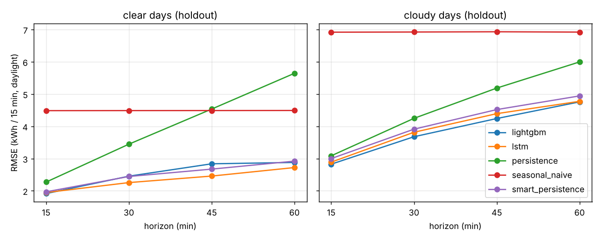
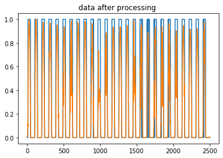
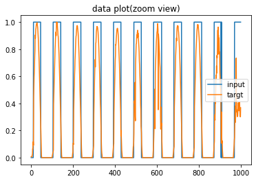
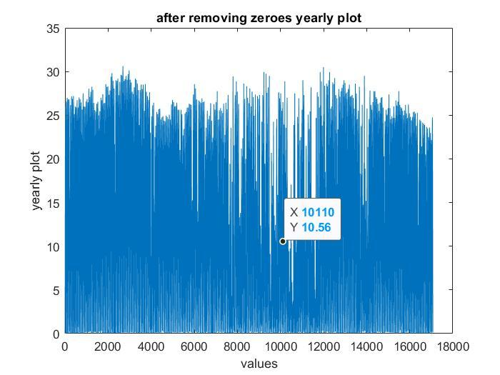
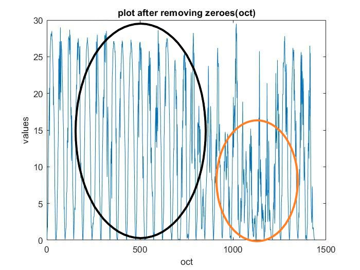
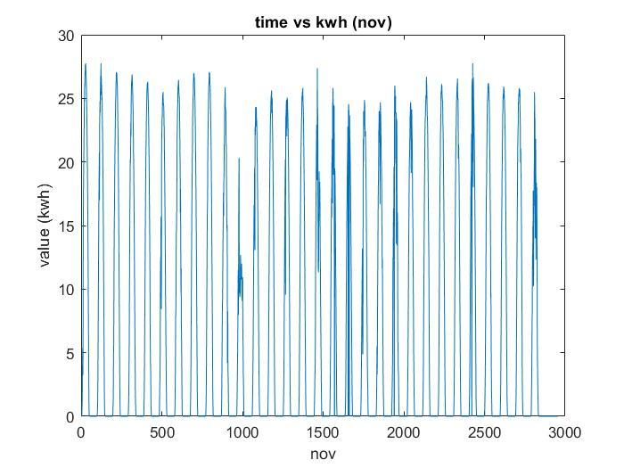
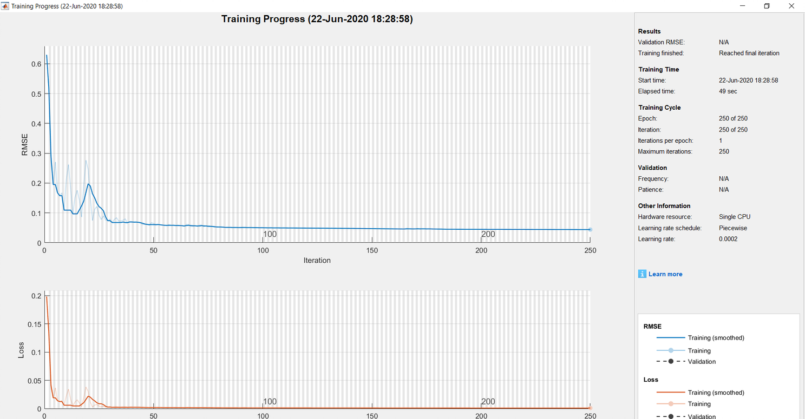
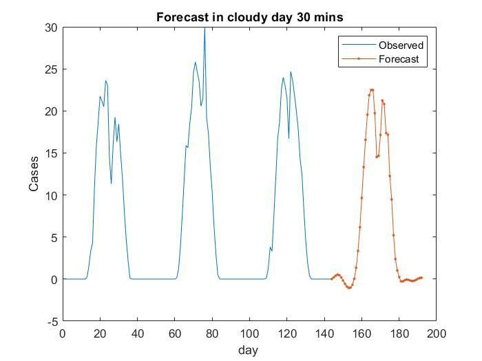
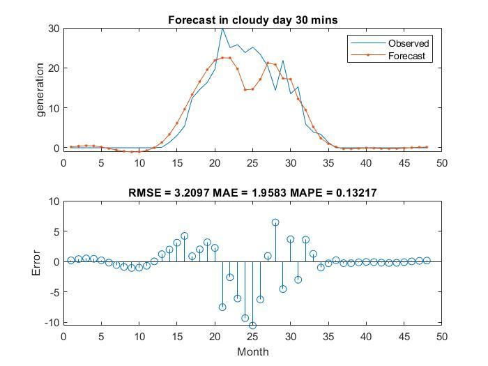
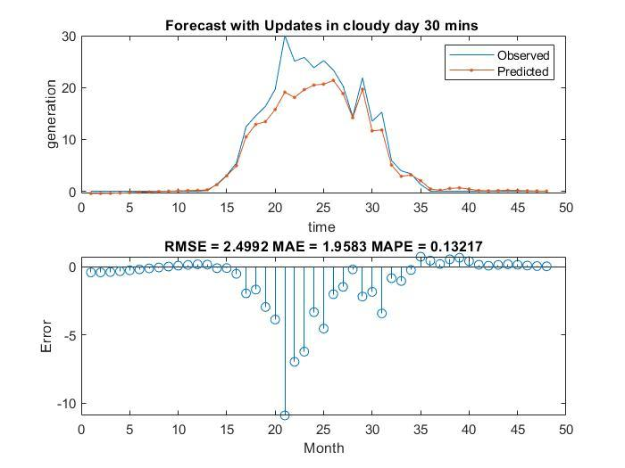

# Forecast of solar generation (NITK Surathkal)

Short-term (15 / 30 / 45 / 60 minute) forecasting of PV generation from one year of 15-minute
data, rebuilt as a reproducible Python package (`solarcast`) with honest baselines. The original
MATLAB LSTM project is preserved in `matlab/code.m` and described at the bottom of this file.

## The data

Two Excel workbooks sit in the repo root: `Generation data.xlsx` (header "Main Building - Energy
Meter Export (kWh)") and `Irradiation data.xlsx` ("Sensor - Irradiance (with coeff)", labelled
Wh/m2 but with peak values around 1000-1350 it behaves like W/m2). What is really in them:

* **Layout**: each sheet is 12 side-by-side `(Date, value)` column pairs, one per month,
  covering 2018-12-01 to 2019-12-01 on a 15-minute grid (35,040 slots).
* **Timestamps are corrupted by Excel**: days 1-12 of every month were parsed as `mm/dd`
  (day and month swapped, e.g. 1 Nov 2019 is stored as 11 Jan 2019) while days 13-31 are plain
  `dd/mm/yyyy` text. `solarcast.data` swaps them back; after that every stamp lies on the 15-minute grid with no
  duplicates (the raw sheets have 434 missing generation slots and 7 missing irradiation slots,
  which become NaN on the regular grid).
* **Generation spikes**: 258 readings (0.75%) are paired `-X, +X` values of about 500,000 (a
  cumulative meter register leaking in; e.g. 2018-12-01 08:15/08:30). Genuine values lie in
  0-30.6 kWh per 15 minutes. The MATLAB code hid this with `TestIp>50 = 30`. Spikes are set to NaN.
* **Missing data**: generation lacks 00:00-05:15 on the first day of each month (night, filled with
  0 only where irradiation confirms darkness) and all of 2019-08-28/29 (outage; irradiation is
  also NaN there). After cleaning: 1.2% of generation and 1.3% of irradiation values are NaN.
* **Alignment**: the two sheets are offset by 21 rows in the raw files (generation starts at
  05:30, irradiation at 00:15) -- this is why the MATLAB code slices rows `76:459` against
  `97:480` by hand. Matching on timestamps removes the need for that. Correlation of generation
  with irradiation is highest when irradiation is taken one step (15 min) later (0.957 vs 0.955
  at lag 0), i.e. the irradiation stamp looks like an interval-end label; the effect is small and
  not corrected.

## How to run

```bash
uv sync                                   # core deps (numpy, pandas, openpyxl, scikit-learn, lightgbm, matplotlib)
uv run solarcast evaluate                 # baselines + LightGBM (LSTM is skipped unless torch is installed)
uv run --extra deep solarcast evaluate    # adds the small LSTM (installs torch)
uv run --extra deep --extra foundation solarcast evaluate --models lightgbm lstm chronos
uv run pytest && uv run ruff check src tests && uv run ruff format --check src tests
```

`evaluate` writes `results/metrics.csv` and `results/rmse_by_horizon.png` and prints the tables.
Options: `--protocol holdout|rolling|both`, `--data-dir`, `--out-dir`. The whole default run takes
about two minutes on CPU. Chronos needs to download Hugging Face weights; if that fails it is
skipped with a warning (it could not be downloaded in the environment used to produce the numbers
below, so **Chronos was not evaluated**).

### Method

* **Task**: at origin time `t`, using only observations up to `t` (generation, irradiation,
  calendar terms, and a *causal* clear-sky envelope), forecast generation at `t + h` for
  h = 15/30/45/60 min. There is no weather forecast, and no future irradiation is used.
* **Clear/cloudy labels** (`labeling.py`): pvlib was not used because a physical clear-sky model
  needs the PV system's capacity/tilt/losses to be comparable with metered kWh. Instead the
  envelope is the 95th percentile, per time-of-day slot, over a 31-day rolling window. The daily
  clearness index is `sum(generation) / sum(envelope)`; days with index >= 0.8 are `clear`, the
  rest `cloudy`, days with < 90% of daylight observed are `unknown` (excluded from the regime rows).
  This gives 199 clear, 160 cloudy, 7 unknown days. The envelope is biased low in the monsoon
  (June-Sept), so some monsoon "clear" days are relative. Labels use the same-day outcome, so
  they are for stratified *reporting* only, never a model input.
* **Models**: `persistence`; `smart_persistence` (persist the clearness ratio and multiply by the
  causal envelope at the target time); `seasonal_naive` (value one day earlier at the target time);
  `lightgbm` (one regressor per horizon on lags, rolling statistics, clearness ratio, envelope and
  time-of-day/day-of-year terms); `lstm` (one 32-unit LSTM over a 4 h window, all four horizons
  jointly; PyTorch CPU, fixed seed, fixed physical scaling so nothing is fitted on test data).
* **Splits** (`splits.py`, never shuffled): *holdout* = chronological 60/20/20 by whole days, scored
  on the final 20% (2019-09-19 to 2019-12-01); models are fitted on targets before the test start
  (train + validation, the last 15% of the fit days are used for LightGBM early stopping). *Rolling
  origin* = 4 expanding-window folds of 30 days each (2019-08-04 to 2019-12-01). A gap of 4 steps
  removes training rows whose target would overlap the test block.
* **Scoring** (`metrics.py`): RMSE in kWh per 15 minutes on **daylight steps only**, on exactly the
  same rows for every model; `skill = 1 - RMSE / RMSE_persistence`. Rows are split by the label of
  the target's day. Rows with a missing target or a missing forecast are dropped, never imputed.

## Results (real output of `solarcast evaluate`)

Holdout (test = 2019-09-19 to 2019-12-01: 1,927 clear-day and 1,168 cloudy-day daylight steps per
horizon). RMSE in kWh / 15 min, skill vs persistence in brackets:

| Regime | Model | 15 min | 30 min | 45 min | 60 min |
|---|---|---|---|---|---|
| clear | persistence | 2.271 | 3.446 | 4.534 | 5.644 |
| clear | smart persistence | 1.968 (+0.13) | 2.443 (+0.29) | 2.672 (+0.41) | 2.920 (+0.48) |
| clear | seasonal naive | 4.485 (-0.98) | 4.487 (-0.30) | 4.488 (+0.01) | 4.491 (+0.20) |
| clear | LightGBM | **1.914 (+0.16)** | 2.453 (+0.29) | 2.837 (+0.37) | 2.879 (+0.49) |
| clear | LSTM | 1.946 (+0.14) | **2.254 (+0.35)** | **2.457 (+0.46)** | **2.721 (+0.52)** |
| cloudy | persistence | 3.085 | 4.247 | 5.186 | 5.996 |
| cloudy | smart persistence | 2.999 (+0.03) | 3.911 (+0.08) | 4.519 (+0.13) | 4.943 (+0.18) |
| cloudy | seasonal naive | 6.919 (-1.24) | 6.924 (-0.63) | 6.932 (-0.34) | 6.922 (-0.15) |
| cloudy | LightGBM | **2.826 (+0.08)** | **3.677 (+0.13)** | **4.241 (+0.18)** | **4.757 (+0.21)** |
| cloudy | LSTM | 2.889 (+0.06) | 3.815 (+0.10) | 4.393 (+0.15) | 4.775 (+0.20) |

Rolling origin, pooled over 4 folds (more data, so less noisy than the single holdout):

| Regime | Model | 15 min | 30 min | 45 min | 60 min |
|---|---|---|---|---|---|
| clear | persistence | 2.314 | 3.482 | 4.574 | 5.669 |
| clear | smart persistence | 2.054 (+0.11) | 2.534 (+0.27) | 2.791 (+0.39) | 3.034 (+0.46) |
| clear | LightGBM | 1.982 (+0.14) | 2.485 (+0.29) | 2.788 (+0.39) | 2.920 (+0.48) |
| clear | LSTM | **1.901 (+0.18)** | **2.235 (+0.36)** | **2.510 (+0.45)** | **2.707 (+0.52)** |
| cloudy | persistence | 3.229 | 4.540 | 5.328 | 5.959 |
| cloudy | smart persistence | 3.273 (-0.01) | 4.419 (+0.03) | 4.963 (+0.07) | 5.298 (+0.11) |
| cloudy | LightGBM | **3.019 (+0.07)** | **4.046 (+0.11)** | **4.521 (+0.15)** | **4.915 (+0.18)** |
| cloudy | LSTM | 3.032 (+0.06) | 4.083 (+0.10) | 4.603 (+0.14) | 4.988 (+0.16) |

(Seasonal naive and the "all days" rows, MAE and nRMSE are in `results/metrics.csv`; the plot is
`results/rmse_by_horizon.png`.)



### What this says (plainly)

* **The old story does not survive a baseline.** The MATLAB write-up reported an LSTM RMSE with no
  reference point. Here plain persistence is the number to beat, and the gains over it are modest
  at short range: 6-18% lower RMSE at 15 minutes (both learned models), growing to roughly 16-52%
  at 60 minutes (cloudy vs clear days), where persistence degrades fast.
* **Smart persistence is a strong baseline.** On clear days it matches or nearly matches the
  learned models at 30-60 min, and the LSTM is ahead of LightGBM by up to ~13% RMSE (holdout, 45 min). A model
  that merely persists the clearness ratio gets most of the achievable gain. On cloudy days it is
  clearly worse than the learned models at 15-30 min, and in the rolling evaluation it is slightly
  *worse* than persistence at 15 min (-0.01).
* **LightGBM vs LSTM is close to a tie.** LightGBM is a little better on cloudy days (both
  protocols); the LSTM is better on clear days from 30 min onward. Differences are within roughly 2-13%
  of RMSE, from a single seed and no significance testing -- do not read an ordering into them.
* **Cloudy days remain hard**: skill vs persistence never exceeds +0.21 for any model. Seasonal
  naive is useless (worse than persistence at 15-30 min), as expected for intermittent cloud.

## Limitations

* One site, one year, one split of the calendar: the holdout test is Sep 19 - Dec 1 (post-monsoon),
  while the training data contains only the first half of the monsoon. Results may not transfer to
  other seasons; rolling origin is a partial check only.
* No confidence intervals or multiple seeds; the LSTM is small and untuned, LightGBM lightly tuned
  (fixed hyperparameters).
* The clear/cloudy split is a threshold on a data-driven envelope (not a physical clear-sky
  model), and uses the day's own outcome, so the clear/cloudy rows are diagnostic strata and not a
  forecastable condition.
* Irradiation is used only as a lagged *input*; no numerical weather prediction or sky imagery.
* Irradiation units are ambiguous (see above), and the one-step timestamp offset is not corrected.
* Chronos (zero-shot) code is included but untested end to end: weights could not be downloaded
  in the build environment, so no Chronos numbers exist.
* Evaluation is on daylight steps only; night is trivially zero and would flatter every model.

## How the MATLAB code differs (for the record)

Reading `matlab/code.m`: the network input is `[irradiation(t); generation(t)]` and the target is
`generation(t+1)`; during the test period it is fed the *measured* irradiation plus its own previous
prediction (so it is a step-ahead nowcast with future irradiation observed, not a forecast from
generation alone). Normalisation uses the min/max of the whole series (including the test part),
days were chosen by eye and hard-coded as row ranges (e.g. a 384-row, four-day slice with a
75/25 split), noise was handled with `TestIp>50 = 30`, and there was no baseline. The README below
is ambiguous about which series is "input" and which is "target"; the code answers it as above.

---

# Original MATLAB write-up

The irradiation and generation data provided in excel sheets contains lot of noise and NAN values and the data isn't aligned as well ie there are irregularities in the data.
The data is measured at every 15 minute interval for one year of solar irradiation and solar generation on the solar panels in NITK Surathkal.

# Preprocessing the data

The first step is to preprocess the data. The irradiation and generation data are measured in different units and hence for better training , testing and prediction the noise in the data has to removed and the data should be normalized. The zero valeus have to be removed.

The generation data is used as training data(input) and irradiation data is used testing data(target) . 
After removing the noise , NAN values , zero values and normalizing the data we the below plot . 





<br>

Taking plot of 1000 points for better clarity





<br>


# Clear and Cloudy Days





<br>
We can differentiate between the clear days and the cloudy days by analysing the data plots.





<br>

For instance the this plot above is of October. We can clearly see that on the days marked in Orange the solar generation is lower compared to the other days (marked in Black). We conclude the days with lower generation as Cloudy days and remaining days as Clear days .
The Y-axis represents units generated(KWh) and X-axis represents Time data points one unit is 15 mins.

# Testing , Training 
After carefully analysing the data set we need to divide them into clear day data and cloudy day data.<br>
Cloudy generation data and its corresponding irradiaton data set are sliced and joined. <br>
To forecast for every 15,30,45 and 60 mins we need the data for every 15,30,45 and 60 min interval. <br>
Alternate points are taken from the given 15 min data points to create the 30 mins data set. <br>
Similary every third and fourth data is taken from the 15 min data set to get 45 and 60 min data set.<br>


# RNN
An artifical recurrent neural network based on LSTM(long short-term memory) ANN is used . <br>
We train a sequence-to-squence regression LSTM network where the responses are training sequences with values<br>
shifted by one time step. It means at every time step of the input sequence the LSTM network learns to predict the value of the next time step.<br>
The LSTM network predicts the forecast and then the network state is updated using the observed values.<br>



<br>
<br>

We used the predictAndUpdateState function to forecast the multiple time steps in the future and update the network step at each prediction. 

<br> 
The generation data set for each forecast is divided into two parts for training and testing  in the ratio 3:1,
ie 75% training and 25% testing.




<br>


# Forecast 
We have a total of 8 forcasts 15,30,45 and 60 mins for 2 days of clear and cloudy day. 
We are going to consider Forecast of Cloudy day at every 45 min interaval here.
The LSTM model is trained of 75% of the data and uses root-mean-square error(RMSE) for the training progress




<br>





<br>
<br> 

# Update 
If the network state is update using the acutal values ,the forecast is more accurate . 
The network state is initialized and reset . Resetting the network state prevents the previous prediction from affecting the predictions on new data. The network state is intialized on the new training data. 
The resultant forecast is more accurate .
 




<br>

#  Code 
The code forecasts  and produces plots  for all the datasets.


